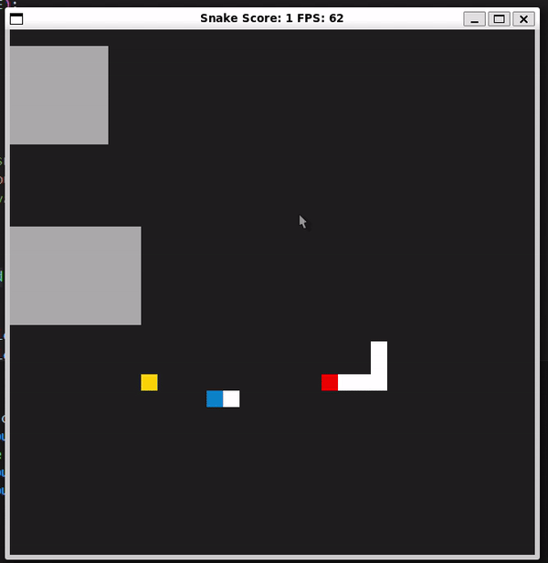

# CPPND: Capstone Snake Game Example

This is a starter repo for the Capstone project in the [Udacity C++ Nanodegree Program](https://www.udacity.com/course/c-plus-plus-nanodegree--nd213). The code for this repo was inspired by [this](https://codereview.stackexchange.com/questions/212296/snake-game-in-c-with-sdl) excellent StackOverflow post and set of responses.

The Capstone Project gives you a chance to integrate what you've learned throughout this program. This project will become an important part of your portfolio to share with current and future colleagues and employers.

In this project, you can build your own C++ application or extend this Snake game, following the principles you have learned throughout this Nanodegree Program. This project will demonstrate that you can independently create applications using a wide range of C++ features.

## Dependencies for Running Locally
* cmake >= 3.7
  * All OSes: [click here for installation instructions](https://cmake.org/install/)
* make >= 4.1 (Linux, Mac), 3.81 (Windows)
  * Linux: make is installed by default on most Linux distros
  * Mac: [install Xcode command line tools to get make](https://developer.apple.com/xcode/features/)
  * Windows: [Click here for installation instructions](http://gnuwin32.sourceforge.net/packages/make.htm)
* SDL2 >= 2.0
  * All installation instructions can be found [here](https://wiki.libsdl.org/Installation)
  >Note that for Linux, an `apt` or `apt-get` installation is preferred to building from source. 
* gcc/g++ >= 5.4
  * Linux: gcc / g++ is installed by default on most Linux distros
  * Mac: same deal as make - [install Xcode command line tools](https://developer.apple.com/xcode/features/)
  * Windows: recommend using [MinGW](http://www.mingw.org/)

## Basic Build Instructions

1. Clone this repo.
2. Make a build directory in the top level directory: `mkdir build && cd build`
3. Compile: `cmake .. && make`
4. Run it: `./SnakeGame`.

## CC Attribution-ShareAlike 4.0 International

Shield: [![CC BY-SA 4.0][cc-by-sa-shield]][cc-by-sa]

This work is licensed under a
[Creative Commons Attribution-ShareAlike 4.0 International License][cc-by-sa].

[![CC BY-SA 4.0][cc-by-sa-image]][cc-by-sa]

[cc-by-sa]: http://creativecommons.org/licenses/by-sa/4.0/
[cc-by-sa-image]: https://licensebuttons.net/l/by-sa/4.0/88x31.png
[cc-by-sa-shield]: https://img.shields.io/badge/License-CC%20BY--SA%204.0-lightgrey.svg

## New feature
1. Choose level at start
When start game you must choose level 0,1,2 to start with different speed
2. Save high score
if you play good and you get highest score, so you should have change to enter your name to save in file highscore.txt
3. There are 2 snakes, 1 controled by user, 1 controler by A* argorithm
you can control 1 snake by keyboard, other snake is controled by automated process used A star argorithm
4. Multiple type of food
After your snake eat 5 foods then you have change to eat a food with higher score
5. Support various obstacle
There are 2 obstacles in the board game, you should avoid it when control snake other your snake will dead.

## Ruplic
### Loops, Functions, I/O
* The project demonstrates an understanding of C++ functions and control structures.
    - controller.cpp: line 12, 43

* The project reads data from a file and process the data, or the program writes data to a file.
    - game.cpp: line 27, line 64

* The project accepts user input and processes the input.
    - controller.h: line 15,22

### Object Oriented Programming
* One or more classes are added to the project with appropriate access specifiers for class members.
    - file snake.h: class Snake has some puclic attribute & method, but also private atribute.
    - file controller.h: class COntroller, method HandleInput is public, and ChangeDirection is protected
    - file game.h: class Game, there are both private & public member.

* Overloaded functions allow the same function to operate on different parameters.
    - file food_planner.h line 61,62 method CalculateHValue() 
    - file food_planner.h line 25,28,32 overload method Node()

* Classes follow an appropriate inheritance hierarchy with virtual and override functions.
    - file controller.h method HandleInput() line 9, 19, 29 

### Memory Management
* The project makes use of references in function declarations
    - file food_planner.h method getDirection() line 49
    - file game.h method Run() line 43
    - file snake.h method UpdateBody() line 33

* The project uses destructors appropriately.
    - file render.cpp method ~Renderer() 
    - file game.cpp method ~Game() line 93

* The project uses smart pointers instead of raw pointers.
    - file game.h, vector snakes at line 47, vector controllers at line 48
    - file renderer.h method Render() at line 16

### Concurrency
* The project uses multithreading.
    - file game.cpp: line 121 use another task to search path for process controller, line 125 start render at another thread.
* A mutex or lock is used in the project.
    - file game.cpp line 10, line 22

 
